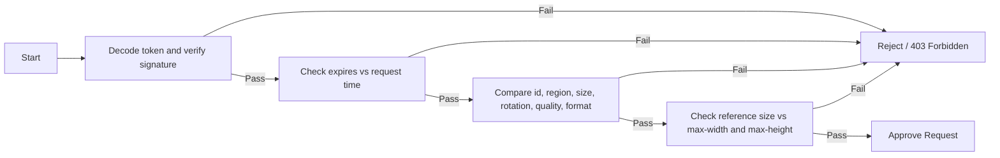

# Signed URI Authorization for IIIF Image Resources

## Introduction

This document describes a method of using a signed [JavaScript Web Token](https://jwt.io/) (JWT) as a mechanism to grant access to, and limit the scope of, requests using the [IIIF Image API](https://iiif.io/api/image/3.0/).

### Use Cases

Cryptographic signature authorization can be used to create shareable links to resources that are otherwise unavailable to the public or via standard access controls. Furthermore, they can limit the Image API URI parameters to a list of allowed values that is narrower than the full Image API would support otherwise. This might be used, for example, to provide access to a scaled-down view of a specific region of an image to a researcher who does not otherwise have access, while preventing editing of the URI to gain access to the image as a whole and/or a higher resolution version of the region.

### Terminology

The term **auth signature** is used to refer to the cryptographically signed JavaScript Web Token containing the terms under which the request should be authorized.

The terms **reference size**, **reference width**, and **reference height** are used to refer to the dimensions of the full, un-cropped image resource *after* the region and size parameters in the request are applied. As a trivial example, for underlying image content with a size of `8192x6144` and a request that begins with `/0,0,256,256/128,`, the **reference size** would be `4096x3072` (because the request is an effective 50% reduction). If the `size` is expressed as a `pct:` or `full`, the **reference size** will be calculated independent of the region.

## Auth Signature

### Structure

The auth signature for the request is provided as an HTTP query parameter appended to the request, e.g.:

```
https://iiif.example.edu/:image-id/:region/:size/:rotation/:quality.:format?Auth-Signature=:auth-signature
```

where `:auth-signature` is a cryptographically signed JavaScript Web Token with the following structure:

```javascript
{
  "id": "image-id",               // image ID, required
  "region": ["0,0,256,256"],      // list of authorized IIIF region values, optional
  "size": ["pct:50"],             // list of authorized IIIF size values, optional
  "rotation": ["0", "180", "!0"], // list of authorized IIIF rotation values, optional
  "quality": ["bitonal", "gray"], // list of authorized IIIF quality values, optional
  "format": ["jpg", "png"],       // list of authorized IIIF format values, optional
  "max-width": 1024,              // maximum reference width in pixels, optional
  "max-height": 768,              // maximum reference height in pixels, optional
  "expires": 1687550764           // expiration timestamp, required
}
```

### Cryptographic Signature

The token can be signed using either a symmetric (`HMAC`) or key pair (`RSA` or `ECDSA`) algorithm. Maintenance of the encryption secret or public/private keys is beyond the scope of this document.

### Validation



Validation is carried out via a series of 4 tests. If any of the tests fails, the request is immediately rejected (e.g., with an HTTP `403 Forbidden` status) and the remainder of the tests skipped.

1. The token is decoded and its signature cryptographically verified.
2. The `expires` value (expressed as whole seconds since `1970-01-01T00:00:00.000Z`) is compared to the date and time of the request.
3. The `id`, `region`, `size`, `rotation`, `quality`, and `format` values are compared to the corresponding parameters in the request. A URI parameter value that does not match one of the authorized values will cause the test to fail.
4. The reference size of the resulting image is calculated and compared to `max-width` and `max-height`. If either reference dimension exceeds the corresponding `max-`, the test will fail.

## Examples

TODO

## Other Considerations

The `region`, `size`, and `rotation` values are currently indicated as a discrete list of valid options. It would be useful to implement a spec that allows for some flexibility, e.g., inclusion/exclusion boundaries for `region` (as opposed to exact boxes), ranges for `size` and `rotation`. 
